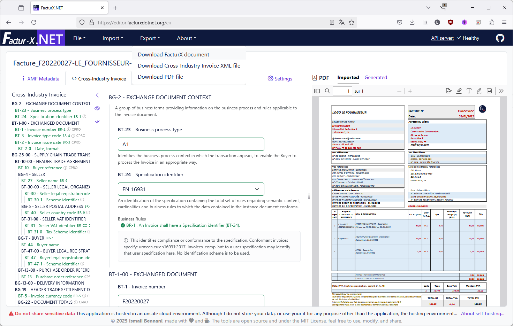

## Generate a Factur-X Document

A Factur-X document is a PDF file that embeds:
- One or more visual pages representing the invoice
- An XML attachment containing invoice data in the **Cross-Industry Invoice (CII)** format
- XMP metadata that indicates compliance with the **PDF/A** and **EN16931** standards
- Optional file attachments

You can generate a Factur-X document using one of the following tools:

## with the Web Editor
Try it live: [https://facturxdotnet.org/editor](https://facturxdotnet.org/editor)

The web editor offers a user-friendly, browser-based interface for creating and editing Factur-X documents. You can upload a PDF and manually enter invoice data in CII format.  
Once you're ready, click **Export > Download FacturX document** to generate and download the final file.



## with the API: `POST /generate/facturx`

Try it live: [https://facturxdotnet.org/api](https://facturxdotnet.org/api/scalar/#tag/generate/POST/generate/facturx)

The `POST /generate/facturx` endpoint allows you to generate a Factur-X document via a multipart request. It combines the following inputs:
- A binary PDF file (**required**)
- CII (Cross Industry Invoice) data in JSON format (**required**)
- XMP metadata in JSON format (**optional**) — if not provided, minimal metadata will be generated automatically
- Additional attachments as binary files (**optional**)

By default, the API validates the provided CII data to ensure it complies with the EN16931 standard before generating the Factur-X document.  
If validation fails, the API responds with a `400 Bad Request` and includes detailed information about the violated business rules in the `errors` field of the response.

**Example Error Response**
```json
{
  "type": "https://tools.ietf.org/html/rfc9110#section-15.5.1",
  "title": "One or more validation errors occurred.",
  "status": 400,
  "errors": {
    "BT-1": ["BR-2"],
    "BT-31": ["BR-CO-9", "BR-CO-26"],
    "BT-30": ["BR-CO-26"]
  }
}
```

Each entry maps a business term (e.g., `BT-1`, `BT-31`) to one or more violated business rules (e.g., `BR-CO-09`). This makes it easier to pinpoint and correct issues in your invoice data.

**Example Usage**
```shell
curl https://api.facturxdotnet.org/generate/facturx \
  --request POST \
  --header 'Content-Type: multipart/form-data;boundary=----549a116c9bd650be51ba2de6c4869b49' \
  --data '
  ------549a116c9bd650be51ba2de6c4869b49
  Content-Disposition: form-data; name="pdf"; filename="base.pdf"
  Content-Type: application/pdf

  ...PDF binary data...
  ------549a116c9bd650be51ba2de6c4869b49
  Content-Disposition: form-data; name="cii"; filename="factur-x.xml"
  Content-Type: application/json

  ...CII JSON data...
  ------549a116c9bd650be51ba2de6c4869b49
  Content-Disposition: form-data; name="xmp"; filename="blob"
  Content-Type: application/json

  ...XMP JSON data...
  ------549a116c9bd650be51ba2de6c4869b49
  Content-Disposition: form-data; name="attachments[0].file"; filename="attachment.ext"
  Content-Type: application/octet-stream

  ...attachment binary data...
  ------549a116c9bd650be51ba2de6c4869b49
  Content-Disposition: form-data; name="attachments[1].description"
  Content-Type: text/plain

  ...attachment description text...
  ------549a116c9bd650be51ba2de6c4869b49
  '
```

[View API reference >](/openapi-specification/post-generate-facturx)

## with the CLI
The `generate` sub-command builds a Factur-X document by combining a PDF file with a Cross-Industry Invoice (CII) data file.  
By default, the tool validates the CII content to ensure compliance before generating the output.

**Example Usage**
```bash
facturx generate --pdf path/to/pdf-file.pdf --cii path/to/cii-file.xml --output-path /path/to/facturx.pdf
```

[View CLI documentation ›](/cli/subcommands/generate)

## with the Library: `FacturXDocumentBuilder`

The `FacturXDocumentBuilder` provides a fluent API for generating Factur-X documents programmatically in C#.  
It simplifies the process of combining the base PDF, invoice data, optional attachments, and metadata — with support for post-processing and XMP customization.

**Example Usage**
```csharp
await using Stream pdfStream = ...;
CrossIndustryInvoice crossIndustryInvoice = ...;
ReadOnlyMemory<byte> firstAttachmentContent = ...;
ReadOnlyMemory<byte> secondAttachmentContent = ...;

FacturXDocument facturXDocument = await FacturXDocument.Create()
    .WithBasePdf(pdfStream)
    .WithCrossIndustryInvoice(crossIndustryInvoice)
    .WithAttachment(new PdfAttachmentData("first-attachment-name.ext", firstAttachmentContent) { Description = "Description of first attachment" })
    .WithAttachment(new PdfAttachmentData("second-attachment-name.ext", secondAttachmentContent))
    .PostProcess(opt =>
    {
        opt.XmpMetadata(xmp =>
        {
            xmp.DublinCore.Creator = ["Name Of Author"];
            xmp.Pdf.Keywords = "Keywords, of, document";
        });
    })
    .BuildAsync();

await using Stream outputStream = ...;
await facturXDocument.ExportAsync(outputStream);
```

[View API reference ›](/api-reference/FacturXDotNet.Generation.FacturX/Classes/FacturXDocumentBuilder)